##Christopher Diep
Solutions Engineer Exercise for digesting technical concepts and presenting them

## Prequisites - Setup the environment (for VM)

Following these instructions: https://www.vagrantup.com/intro/getting-started/
1. I downloaded Vagrant and installed it.
2. I downloaded VirtualBox and installed it.
3. I ran commands `vagrant init hashicorp/precise64` and `vagrant up`
4. After running `vagrant ssh`, I saw an option to upgrade Ubuntu and ran `do-release-upgrade`

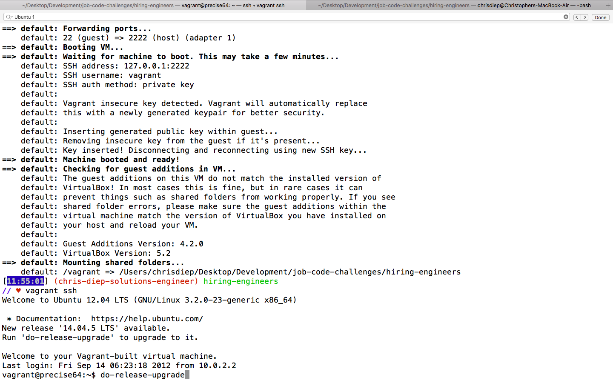

While upgrading, I signed up for Datadog.

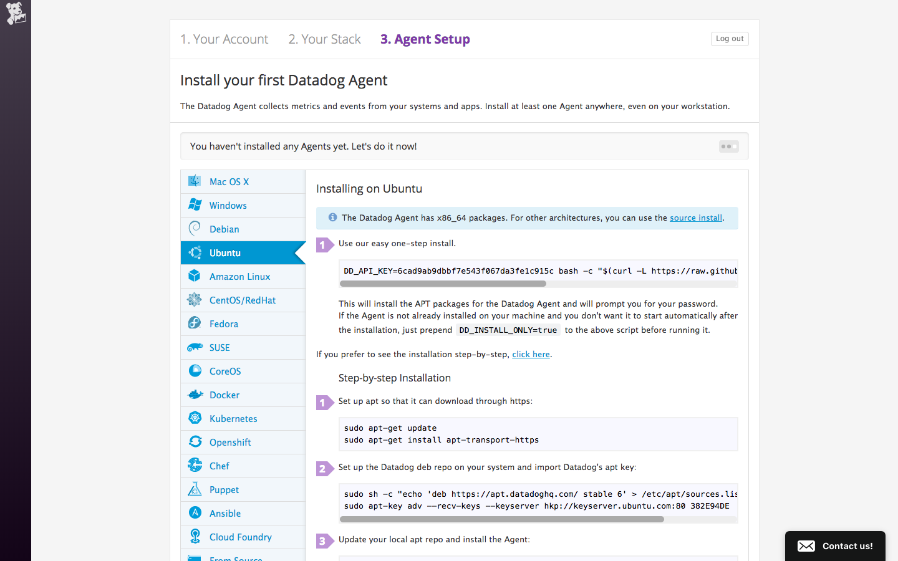

I then followed step-by-step instructions to start the Agent with Ubuntu 14.04. (I could not determine why it would not allow me to update to the recommended version in the Readme earlier. I did see that there was an Agent for the v14.04.)

I went to the Datadog website to see my metrics.

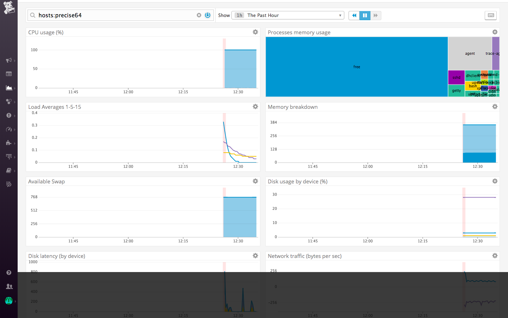

## Collecting Metrics (for VM)
* Add tags in the Agent config file and show us a screenshot of your host and its tags on the Host Map page in Datadog.
I found the path for the Agent config file (/etc/datadog-agent/datadog.yaml) from the documentation: https://docs.datadoghq.com/agent/basic_agent_usage/ubuntu/#configuration

I needed a way to edit the YAML file. I would need to follow these instructions eventually: https://docs.datadoghq.com/getting_started/tagging/assigning_tags/#assigning-tags-using-the-configuration-files

I found code in the Vagrantfile to uncomment out.

```
config.vm.provider "virtualbox" do |vb|
    # Display the VirtualBox GUI when booting the machine
    vb.gui = true

    # Customize the amount of memory on the VM:
    vb.memory = "1024"
  end
```

I set up a desktop environment with these instructions: https://stackoverflow.com/questions/18878117/using-vagrant-to-run-virtual-machines-with-desktop-environment

I can use gedit to edit the YAML file now.
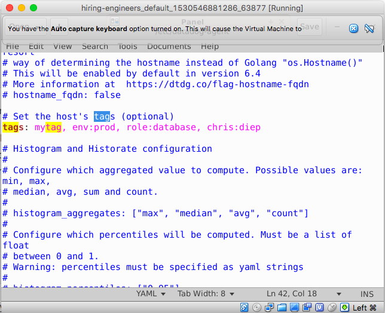

It finally showed up on the Host Map page. I was looking at troubleshooting documentation to see why it was not displaying on the page. It must have just required some time.
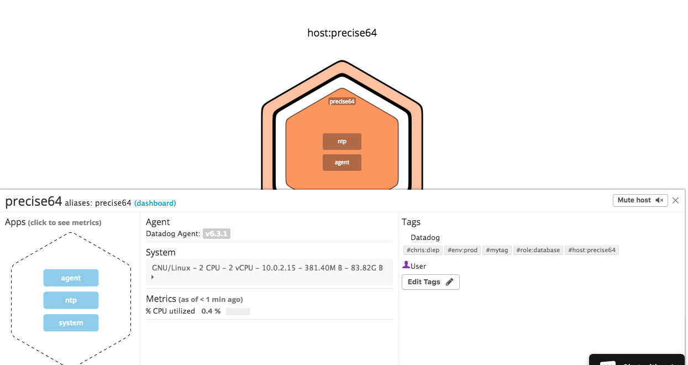

* Install a database on your machine (MongoDB, MySQL, or PostgreSQL) and then install the respective Datadog integration for that database.

---

I decided that installing it directly on my computer would go faster because it is taking me a while to get used to the VM.

## Prequisites - Setup the environment (for MacOS)

I used the command for the install.
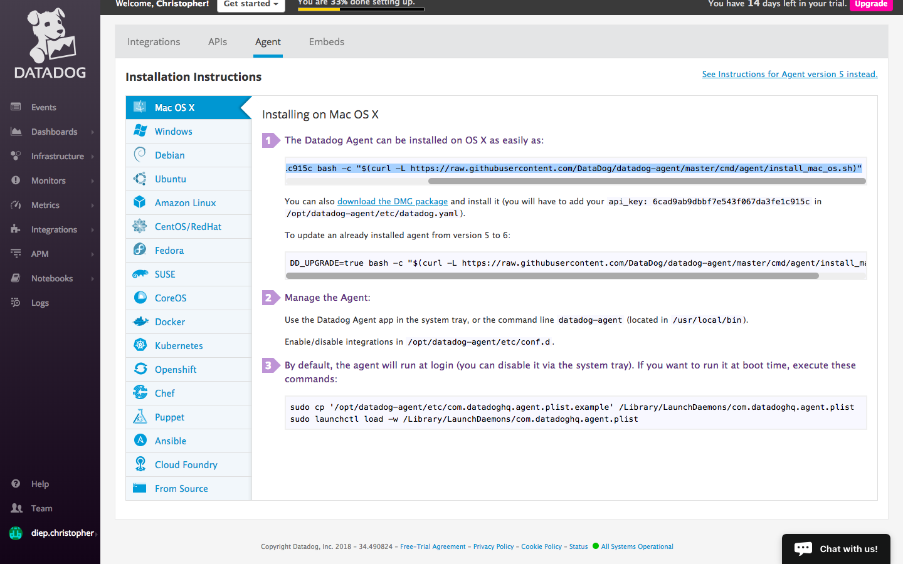

I looked at the metrics.
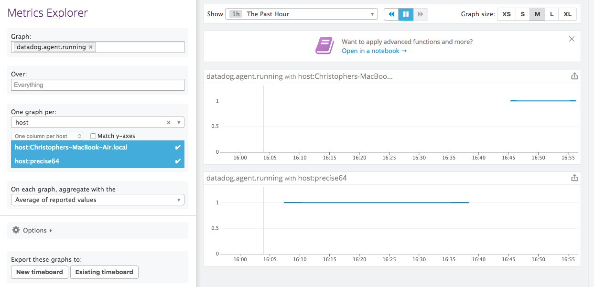

## Collecting Metrics (for MacOS)
* Add tags in the Agent config file and show us a screenshot of your host and its tags on the Host Map page in Datadog.

I found the path for the Agent config file from this: https://docs.datadoghq.com/agent/basic_agent_usage/osx/#configuration

I added tags
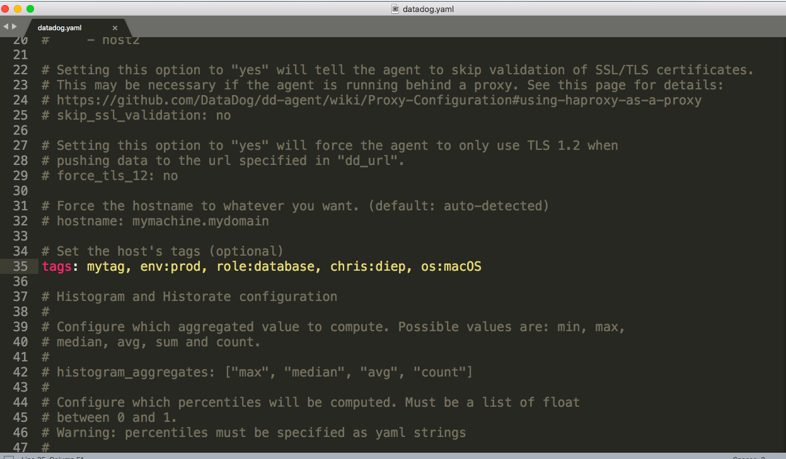

I restarted the Agent and checked the Host Map.
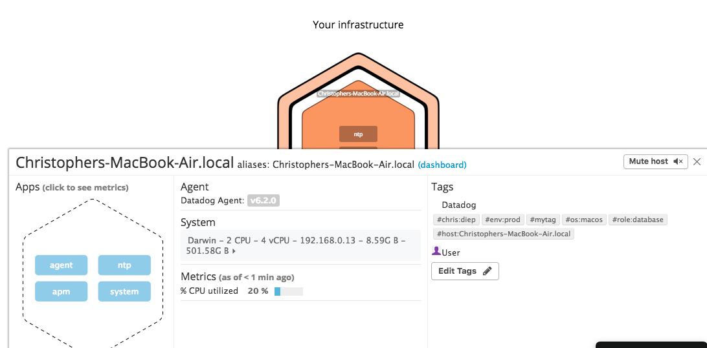

* Install a database on your machine (MongoDB, MySQL, or PostgreSQL) and then install the respective Datadog integration for that database.

Checking the documentation for my already installed PostgreSQL database: https://docs.datadoghq.com/integrations/postgres/

I wrote these commands in terminal after typing `psql`

```
create user datadog with password 'datadog';
grant SELECT ON pg_stat_database to datadog;
```

I verified permissions with this command
```
psql -h localhost -U datadog postgres -c \
"select * from pg_stat_database LIMIT(1);" \
&& echo -e "\e[0;32mPostgres connection - OK\e[0m" \
|| echo -e "\e[0;31mCannot connect to Postgres\e[0m"
```
I found more instructions here:
https://app.datadoghq.com/account/settings#integrations/postgres

I ran into an issue after doing a check with the info command `datadog-agent status`
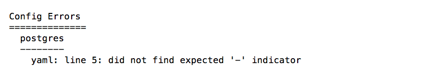

I checked the yaml file.
```
instances:
  - host: localhost
   port: 5432
   username: datadog
   password: datadog
   dbname: PlaceMeApp_development
   ssl: False
#    use_psycopg2: False # Force using psycogp2 instead of pg8000 to connect. WARNING: psycopg2 doesn't support ssl mode.
   tags:
     - optional_tag1
     - optional_tag2
```

I realized the spacing is off after seeing the example on this link: https://github.com/DataDog/integrations-core/blob/master/postgres/datadog_checks/postgres/data/conf.yaml.example

```
instances:
  - host: localhost
    port: 5432
    username: datadog
    password: datadog
    dbname: PlaceMeApp_development
    ssl: False
#    use_psycopg2: False # Force using psycogp2 instead of pg8000 to connect. WARNING: psycopg2 doesn't support ssl mode.
    tags:
      - optional_tag1
      - optional_tag2
      - macos:postgres
```

The check with the info command `datadog-agent status` looks good.
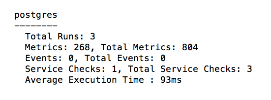
